# **Second** Winner: **@M3RINOOOOO** (Cristobal Merino Saez) 

# HCON 2026 Hardware CTF Writeup 

# short pin

```
- You must short a GPIO to win.
- Using your house key might help ;-)
```

To solve the challenge, you need to create a short on a GPIO to win. In other words, connecting the GPIO they ask for to ground is enough to solve it.

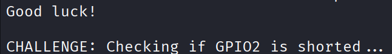

In the picture we can see that we are asked to short GPIO2, so let’s find where it is on the board and how we can connect it to GND.

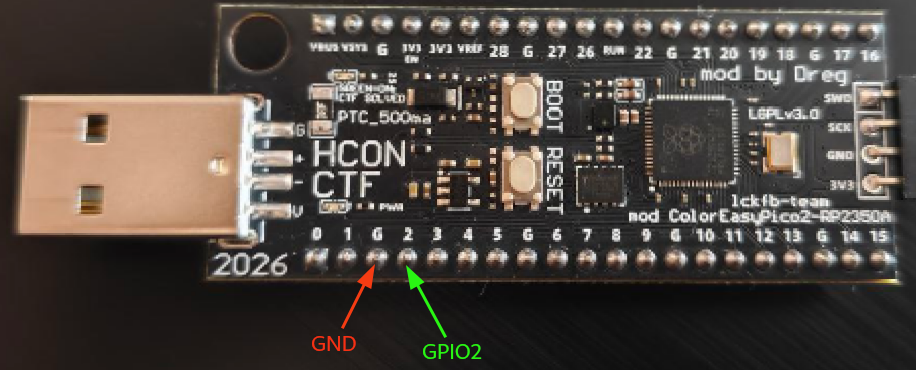

Since they are next to each other, instead of using a cable to connect the pins, a one-cent coin was used to bridge them.

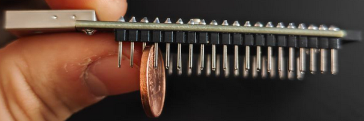

After leaving it like that for a couple of seconds, the flag is shown in the console.

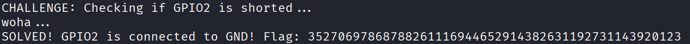

# The switch pattern game

```
- You must test your reflexes in this pattern-matching game.
- Complete 10 rounds without mistakes to win.
```

When starting the challenge, we can see on the board that the green LED (GPIO25) follows a pattern: it blinks a few times, and then the LED stays on for a few seconds. This pattern repeats forever, and each cycle is one round of the `THE DREGAME`.

If we do nothing, every iteration will be a lost round:

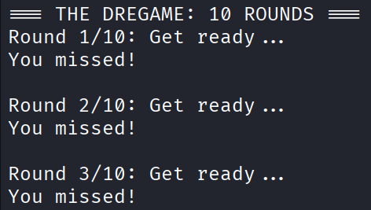

Let’s look at the decompiled code in Ghidra to understand the observed behavior and how to complete the challenge.

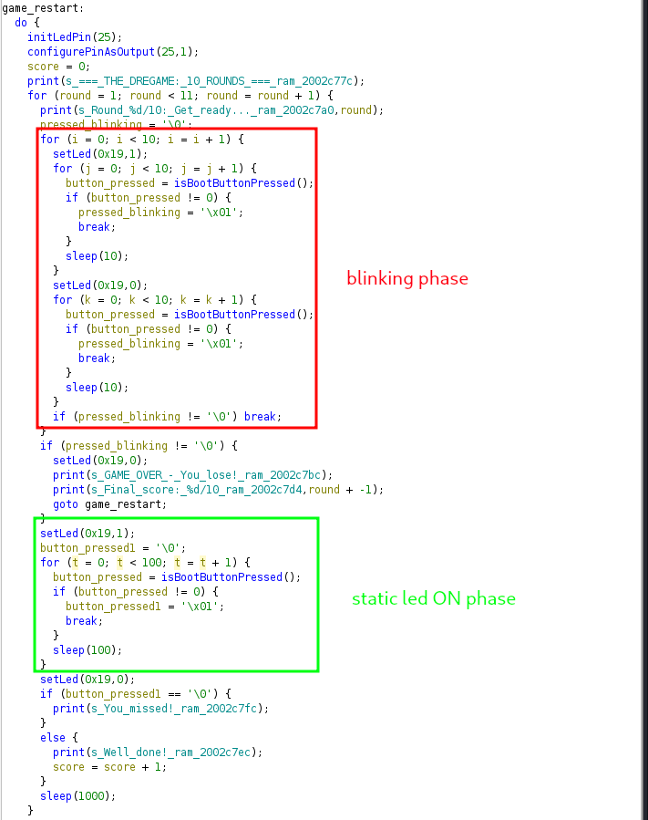

We can identify the two phases mentioned before: the first one where the LED is blinking (on for 10 milliseconds and off for another 10 milliseconds) 10 times, and the second phase where the LED is on for 10 seconds (100 iterations x 100 milliseconds).

It can be seen that after the blinking phase, if the button was pressed during that phase, the round is lost. After the LED ON phase, we can see that if the button is pressed during those 10 seconds, the round is won and one point is added, while if it is not pressed, the round is also lost.


After the 10 rounds, the score is checked as follows:

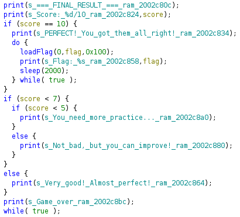

So, the flag is only shown if you get a perfect score. The goal then is to press the BOOT button exactly when it is in the LED-on phase in the 10 rounds, just as shown in the next picture:

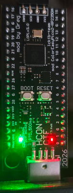

And this is how we get the flag:

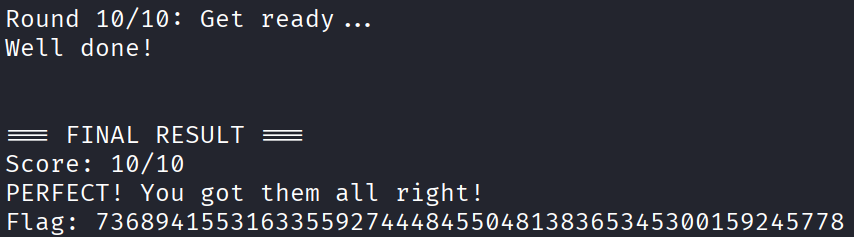

The function isBootButtonPressed was reversed, and it was deduced that it returns whether the BOOT (BOOTSEL) button is pressed, since on Pico boards that button is connected to the `QSPI_SS` line, which is the one found in the function:

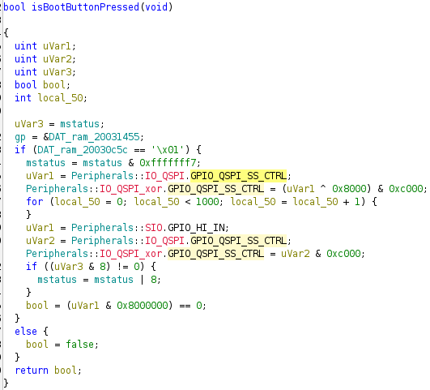

# crazy baud rates

```
- You must understand serial communication and baud rate configuration.
```

When starting the challenge, the only thing we see is that the challenge has started:

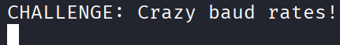

So now it is time to reverse the challenge function in Ghidra’s decompiled code:

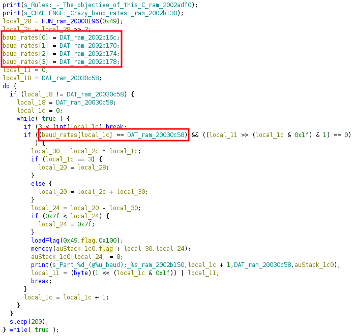

We can see that checks are being made against baud rates stored in memory, already translated in the following image:

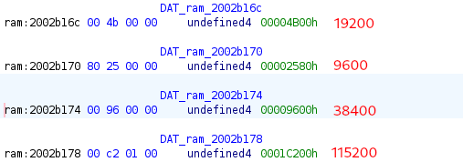

So, we need to modify the baud rate being used once the challenge has started. With tio, which is the tool I used to connect to the board, it was impossible for me to recover part 2 of the flag, and I’m not really sure why.

So I chose picocom, a tool where you can change the baud rate dynamically in a simple way. For that, we run the command to start with a baud rate (500) lower than any of the requested ones:

```
picocom --baud 500 /dev/ttyACM0
```

And once the challenge is started, by pressing `ctrl+a` and `ctrl+u`, the value increases through standard baud rate values, including the required ones:

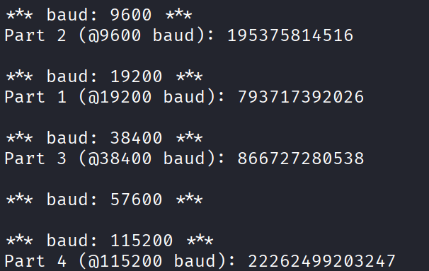

# bypass the BP

```
- You must understand RISC-V exception handling.
- You must understand how to use OpenOCD + GDB to debug RISC-V code.
- You will need another RP2040/RP2350 board to connect with OpenOCD + GDB. (find another participant and flash the Pi Pico Debug Probe firmware on one of them)
- You must make the instruction following the one that caused the exception execute.
```

For this challenge, another board was needed to do debugging. The board configuration and setup were done following the README of the [CTF repository](https://github.com/therealdreg/hcon2026hwctf), that is, creating the files /etc/udev/rules.d/99-pico.rules and /etc/udev/rules.d/99-openocd.rules, and also flashing this [firmware](https://github.com/raspberrypi/debugprobe/releases/download/debugprobe-v2.2.3/debugprobe_on_pico2.uf2).

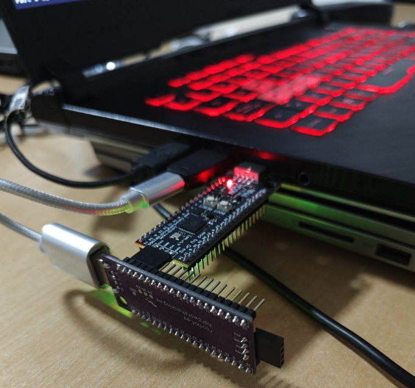

The following command was executed to connect RISCV-openocd:

```
cd /path/to/.pico-sdk/openocd/0.12.0+dev/scripts

/path/to/.pico-sdk/openocd/0.12.0+dev/openocd \
  -s /path/to/.pico-sdk/openocd/0.12.0+dev/scripts \
  -f interface/cmsis-dap.cfg \
  -f target/rp2350-riscv.cfg \
  -c "set USE_CORE { rv0 }" \
  -c "adapter speed 5000" \
  -c "gdb breakpoint_override hard" \
  -c "init"
```

Now, we can start the challenge, and the only thing shown apart from the rules is that the challenge has begun:

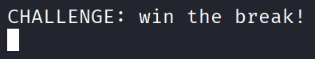

Once the challenge is started, we begin debugging with the following command:

```
# In another terminal (gdb)

cd /path/to/.pico-sdk/openocd/0.12.0+dev/scripts

/path/to/.pico-sdk/toolchain/RISCV_ZCB_RPI_2_2_0_3/bin/riscv32-unknown-elf-gdb -q \
  -ex "set pagination off" \
  -ex "set remote interrupt-on-connect off" \
  -ex "target remote localhost:3333" \
  -ex "monitor targets rp2350.rv0" \
  -ex "monitor halt" \
  -ex "info reg"
```

And now we are debugging the board firmware.

Then we can reverse the challenge function decompiled with Ghidra. We can see the (renamed) function win, which is the one mentioned in the rules that must be executed to pass the challenge:

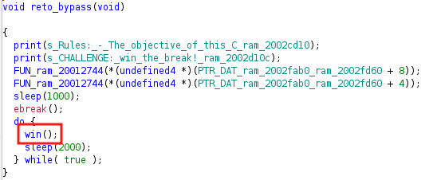

We can get the address of the instruction that calls the function `0x20001b24`:

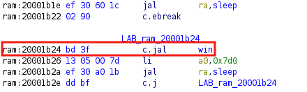

From the debugger terminal, we can set that address into `pc` (program counter), the register that represents the address of the next instruction to execute. After setting it, we can continue the program execution:

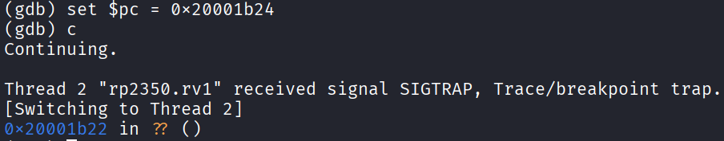

And we can see the flag in the debugged board terminal

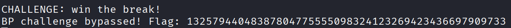

# riscky payvload

```
 - You must craft a special 32-bit RISC-V instruction.
 - The instruction must set register ?? to the magic value.
 - After sending the data, the device will validate the instruction.
 - You must understand RISC-V instruction encoding.
 - The payload will execute your instruction and call solve_this().
```

At the start of the challenge, we see it asks for four bytes, which will represent the instruction to execute:

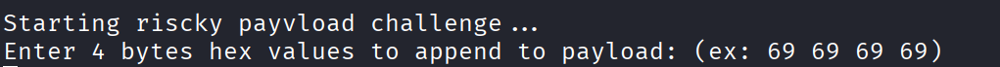

The challenge function looks like this:

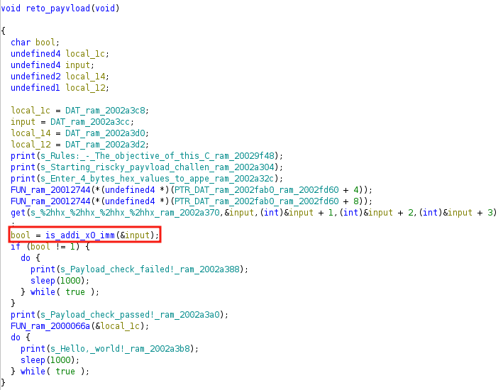

We can see that the first thing done is passing a check, and if it fails, the challenge is lost immediately. So, our first goal is to pass that check so we can keep going:

The function that checks the provided instruction is

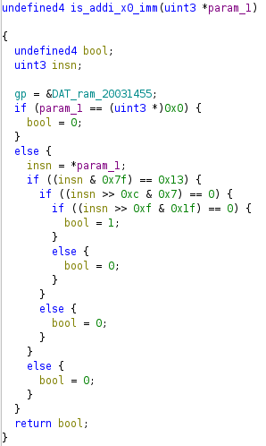


- The function extracts and compares fields from the RISC-V encoding: `opcode` (bits 0–6), `funct3` (bits 12–14) and `rs1` (bits 15–19).
- With `opcode=0x13` (OP-IMM), `funct3=0` (ADDI) and `rs1=0` (x0), it validates that the instruction is `addi rd, x0, imm`, leaving `rd` and `imm` free.


In this [link](https://msyksphinz-self.github.io/riscv-isadoc/#_addi), you can see the different fields and description of the `addi` instruction, which basically has the following implementation:

```
x[rd] = x[rs1] + sext(immediate)
```

In our case, since `rsi=0`, the value `imm` will be stored in register `rd`. Now let’s figure out which register must be modified, and which value (magic byte) is required.

This [tool](https://luplab.gitlab.io/rvcodecjs/) was used, where readable instructions are translated to bytes.

As a first test, we modify register x1 (rd) with value 0x00 (imm), that is, the instruction `addi x1, x0, 0x00`:

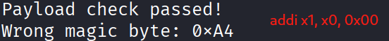

We can see the check was passed, but the required value to modify was not modified, so now we know this is not the register we need to change.

If we iterate the same process with the next registers, we get that the register to modify is `x10`:

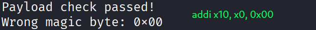

This behavior is coherent with the RISC-V calling convention, where register `x10 (a0)` is used to store the first argument passed to a function. In this case, that register would contain the value corresponding to the _magic number_ that will be validated by the checker function.

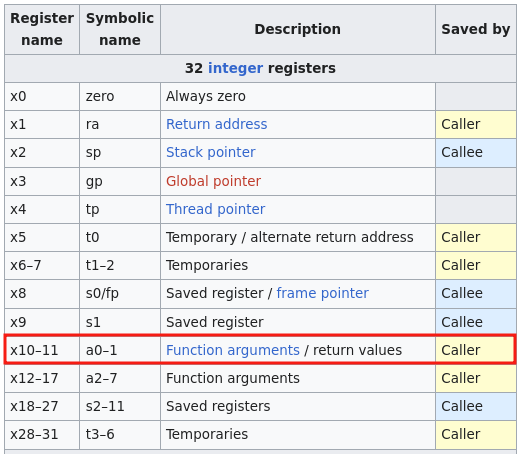


To deduce the magic number, we can search for "Wrong_magic_byte:" in Ghidra, which leads us to the following function:

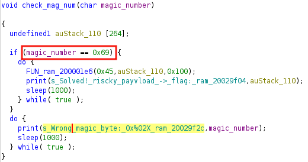

We can see that it checks whether `magic_number` is 0x69, so the instruction we need to send is `addi a0, x0, 0x69`:

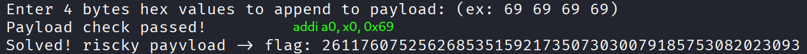

# put led on

```
- You must craft a RISC-V payload to turn ON the LED.
- The payload must be self-contained; you cannot call any external functions or jump outside the payload code.
- You cannot use this challenge to solve others.
- Configure the LED GPIO as an output and write a value of 1 to turn it ON.
- You have 30 seconds to keep the LED ON continuously.
- You must understand RISC-V assembly and GPIO register manipulation.
```

Well, well, well, I had no idea how to configure the board pins as output, or how to write output values to them. So what can I do? Searching in the board [documentation](https://pip-assets.raspberrypi.com/categories/1214-rp2350/documents/RP-008373-DS-2-rp2350-datasheet.pdf?disposition=inline) seems like the most reasonable solution.

There we can see the following special registers, which are exactly designed to configure what we want!


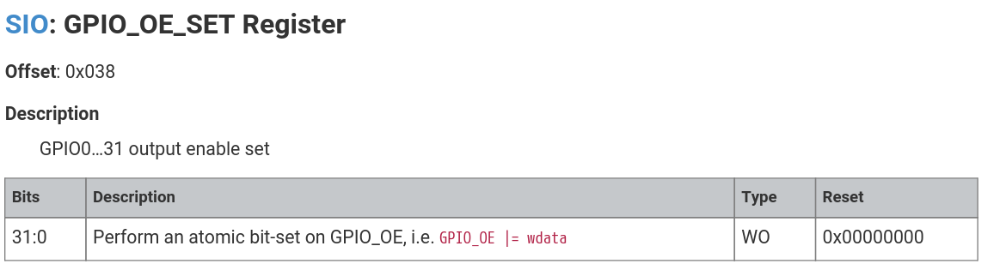


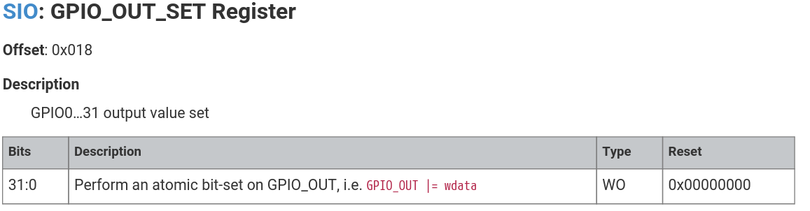

The GPIO_OE_SET register (offset 0x038) lets us configure only the specified GPIOs as output, internally doing `GPIO_OE |= wdata`, meaning it sets to 1 only the written bits without modifying the others; for example, writing `0x02000000` (which is `1 << 25`) enables GPIO25 as output. Interesting.

GPIO_OUT_SET (offset 0x018) works the same way, but it sets the output value. 1 on, 0 off, sounds good right?

As can be seen in the binary, the offsets match those found in the documentation, and the SIO base, which is a hardware block that handles GPIOs, is `0xD0000000`.

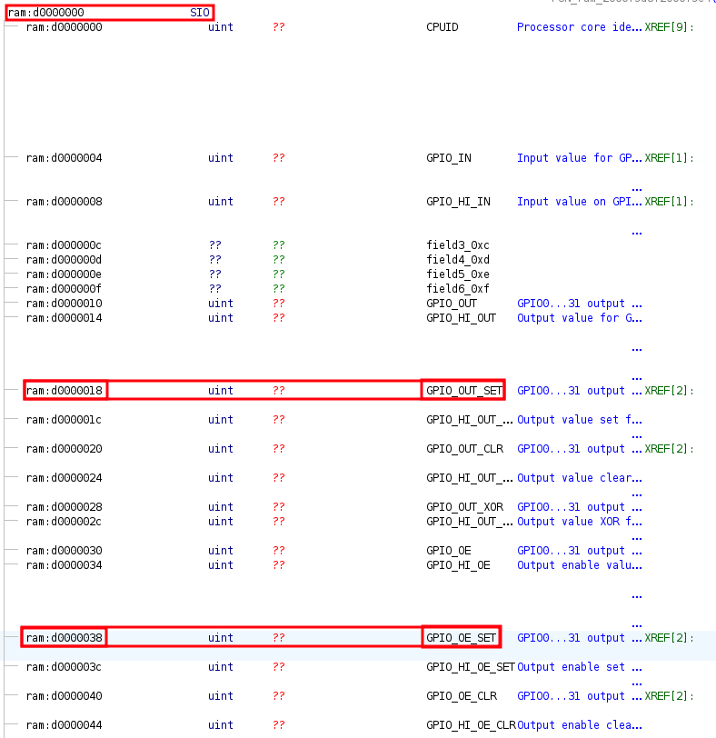

So we already have a first plan, which is nothing more and nothing less than setting the bit corresponding to GPIO25 to 1 in both registers, and theoretically it should work. The plan is cool, but another thing I had no idea about was how to modify those values correctly :P

After a bit of research, I came to the conclusion that in RISC-V, 32-bit constants are loaded like this:

```
lui   rd, upper20
addi  rd, rd, lower12
```

Since `lui` places the U-immediate value "upper20" in the top 20 bits of destination register `rd`, filling the lowest 12 bits with zeros, and then `addi` adds the sign-extended 12-bit "lower12" to register `rd`.

So, for `0xD0000000` and `0x02000000`, if we want to store them in `t1` and `t2` for example (registers reserved for temporary values), we have the following, because the low 12 bits are 0:

```
lui t1, 0xD0000
lui t2, 0x02000
```

This way we already loaded the SIO base value into one register (`t1`), and the value we want to write into GPIO_OE_SET and GPIO_OUT_SET to enable GPIO25 into another (`t2`). Nice!

Now it is time to modify the target registers using `sw`, which stores at address `base + offset`. We already know the offsets, `0x38` and `0x18`, so that pair of instructions is as follows.


```
sw   t2, 0x38(t1)     # GPIO_OE_SET
sw   t2, 0x18(t1)     # GPIO_OUT_SET
```

In principle, these four instructions should turn on the LED. Let’s test it by translating the instructions again with this [tool](https://luplab.gitlab.io/rvcodecjs/); the payload looks like this:

```
37 03 00 d0 b7 03 00 02 23 2c 73 02 23 2c 73 00
```


Let’s go, LED on! Plus, we got the flag:

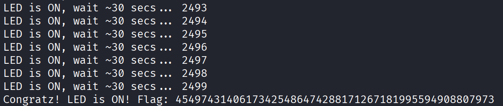

Buuut, there is something that bothers me: before it starts counting how long it has been on and showing the flag, the program throws a core:

```
*** Dreg's RISCV TRAP HANDLER CALLED ***
Core: 1
mepc   = 0x20030bd0
mcause = 0x00000002
mtval  = 0x00000000

=== RISC-V REGISTERS ===
x0/zero    = 0x00000000  x1/ra      = 0x20000b78
x2/sp      = 0x20080be0  x3/gp      = 0x20031455
x4/tp      = 0x00000000  x5/t0      = 0x00001000
x6/t1      = 0xd0000000  x7/t2      = 0x02000000
x8/s0/fp   = 0x20080d60  x9/s1      = 0x00000000
x10/a0     = 0x00000000  x11/a1     = 0x20030cd4
x12/a2     = 0x00000000  x13/a3     = 0x00000001
x14/a4     = 0x00000001  x15/a5     = 0x20080c68
x16/a6     = 0x00b11a85  x17/a7     = 0x00000000
x18/s2     = 0x00000000  x19/s3     = 0x00000000
x20/s4     = 0x00000000  x21/s5     = 0x00000000
x22/s6     = 0x00000000  x23/s7     = 0x00000000
x24/s8     = 0x00000000  x25/s9     = 0x00000000
x26/s10    = 0x00000000  x27/s11    = 0x00000000
x28/t3     = 0x00000009  x29/t4     = 0x00000019
x30/t5     = 0x2002fab0  x31/t6     = 0x2001ea5c

=== STACK DUMP ===
Stack Pointer (sp) = 0x20080be0

Stack from sp-64 to sp+64:
0x20080ba0: 00b11692 000003e8 20080bc4 00000009 
0x20080bb0: 00b11a7a 00000000 20080d60 20000e48 
0x20080bc0: 00001808 00001808 00000000 00000100 
0x20080bd0: 20080bdc 2002b000 00b12f88 00000000 
0x20080be0: 00001808 00121808 2002b4f8 2002b500  <-- SP
0x20080bf0: 2002b508 2002b510 2002b518 2002b520 
0x20080c00: 2002b528 2002b530 2002b538 2002b544 
0x20080c10: 2002b54c 2002b554 2002b55c 2002b564 
0x20080c20: 2002b56c 2002b574 2002b57c 2002b584 

=== CODE DUMP ===
Program Counter (mepc) = 0x20030bd0

Code from mepc-32 to mepc+32:
0x20030bb0: 00000000 00000000 00000000 00000000 
0x20030bc0: d0000337 020003b7 02732c23 00732c23 
0x20030bd0: 00000000 00000000 00000000 00000000  <-- PC (exception here)
0x20030be0: 00000000 00000000 00000000 00000000 
0x20030bf0: 00000000 00000000 00000000 00000000 
*** END TRAP ***
```

From the output after "Code from mepc-32 to mepc+32:", we can deduce it is trying to execute instruction `0x00000000` (non-existent instruction), since the payload we entered has only 4 instructions and the rest of the available space stayed as 0. To fix it, my idea was to add a 5th instruction, `ret`, so execution returns to the value stored in register `ra`. The instruction bytes can be seen in Ghidra as "82 80".


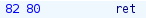

This way, the instruction set would look like this:
```
lui  t1, 0xD0000      # t1 = 0xD0000000 (SIO base)
lui  t2, 0x02000      # t2 = 0x02000000 (1<<25)
sw   t2, 0x38(t1)     # GPIO_OE_SET  (set GPIO25 as an output)
sw   t2, 0x18(t1)     # GPIO_OUT_SET (set GPIO25 value to 1)
ret

####################################################
37 03 00 d0 b7 03 00 02 23 2c 73 02 23 2c 73 00 82 80
```

In the same way, the LED turns on, the flag is shown, and the program no longer crashes :)

# dear x

```
- Classic Stack Buffer Overflow challenge.
- After sending the data, the device will process it and check for validity.
- You must understand how to generate the payload to overflow the stack and redirect execution to the solved() function.
- You cannot use this challenge to solve others, you are only allowed to return to the solved() function.
- You must understand how a stack buffer overflow works on RISCV RP2350.
```

Once the challenge starts, it shows us the address of a function that we must execute:

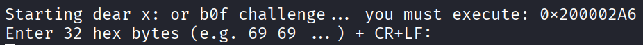

Looking at Ghidra’s decompiled code, we can see that bytes of a key are being stored, and those bytes are used to XOR with the bytes we enter (buf_global).

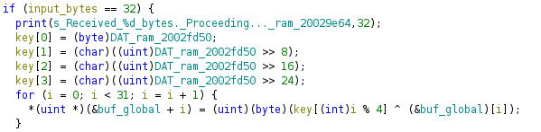

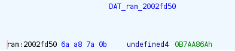

The result of that operation is overwritten into the original buffer (buf_global).

Then, the number of buffer values that are identical is calculated, that is, values that after the XOR with the key ended up with the same value.

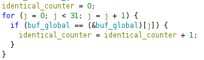

This can be seen as follows:

```
X1 ⊕ 6A = C1
X2 ⊕ A8 = C2
X3 ⊕ 7A = C3
X4 ⊕ 0B = C4
X5 ⊕ 6A = C5
X6 ⊕ A8 = C6
X7 ⊕ 7A = C7
X8 ⊕ 0B = C8
.....
```

Where `Xi` are the bytes entered in `buffer_global`. The counter `identical_counter` will be equal to the number of `Ci` that are equal to `C1`.

After that, it checks whether that counter is greater than 26.

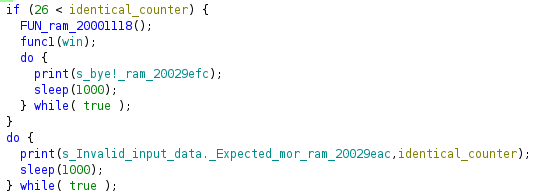
 
The easiest way to get the same constant value is to make the XOR operation return 0, meaning both bytes are equal. So we keep repeating the key bytes over and over:

```
6A ⊕ 6A = 0
A8 ⊕ A8 = 0
7A ⊕ 7A = 0
0B ⊕ 0B = 0
6A ⊕ 6A = 0
A8 ⊕ A8 = 0
7A ⊕ 7A = 0
0B ⊕ 0B = 0
.....
```

So our initial payload is as follows:

```
6A A8 7A 0B 6A A8 7A 0B 6A A8 7A 0B 6A A8 7A 0B 6A A8 7A 0B 6A A8 7A 0B 6A A8 7A 0B 6A A8 7A 0B
```

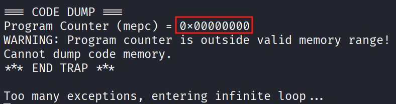

The check was bypassed, but now we get a Core, because it is trying to access the instruction at address `0x00000000`.

If we keep looking at Ghidra code, we can find almost the same buffer overflow case as the one in the [CTF repository](https://github.com/therealdreg/hcon2026hwctf).

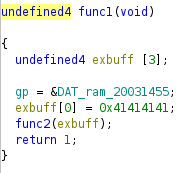
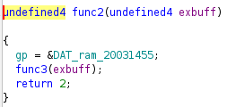
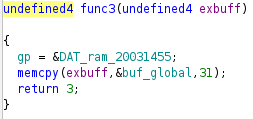

In `func1`, a new buffer (exbuff) of 12 bytes is created, which is passed to `func2`, and then to `func3`. In this last function, the content of `buf_global` (32 bytes) is copied into `exbuff` (12 bytes). This causes a stack overflow.

If we look at the RISC-V instructions executed at the beginning of `func1`, we can see that the value of `ra` is first saved on the stack (return value to main), and then the value of `s0` (callee-saved register used as frame pointer).

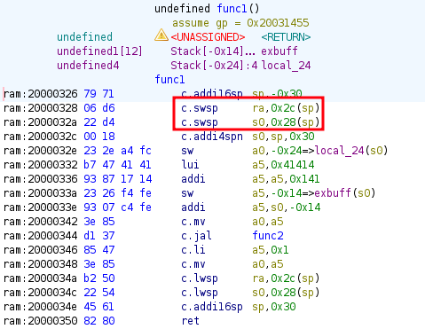

In the next image, you can see the stack right before applying memcpy in `func3`, with `saved_ra` correctly stored so it can return to main (in `func1`'s stack frame), and right after applying `memcpy` with `buf_global`.


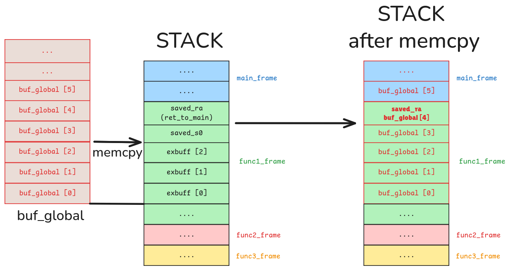

Each `buf_global[i]`, stores 4 bytes.

So, if we want to overwrite the saved `ra` value used to return to main, so that instead of returning to main the flow is redirected to address `0x200002A6`, we have to XOR that address with the key obtained before, and put it into the payload starting from byte 17:

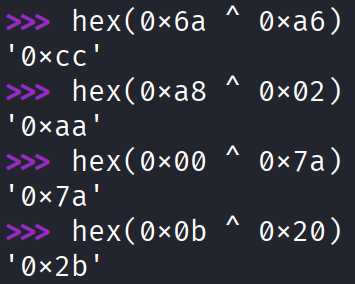

So the payload looks like this:

```
6A A8 7A 0B 6A A8 7A 0B 6A A8 7A 0B 6A A8 7A 0B CC AA 7A 2B 6A A8 7A 0B 6A A8 7A 0B 6A A8 7A 0B
```

And if we send it, we get the flag:

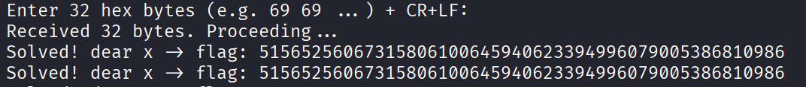